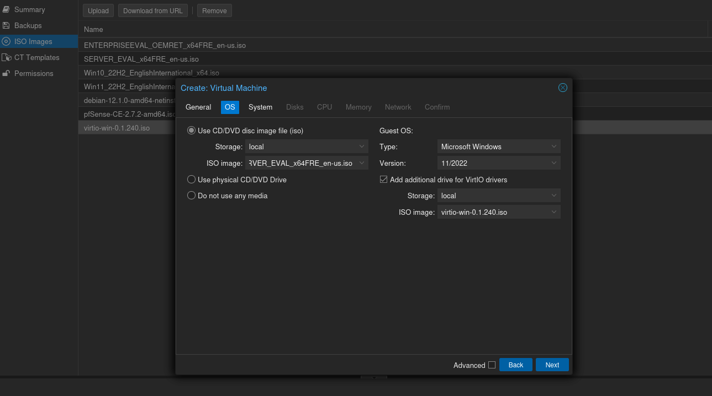

# Objective
In this post, we will look at setting up our Windows guests in our Proxmox home lab. We will create a Domain Controller that acts as the DHCP server for our AD Lab and will also join a Windows 10 host to the domain.

# Requirements
To setup our windows VMs and create our AD lab, we will need the following:
- [Windows VirtIO Drivers](https://pve.proxmox.com/wiki/Windows_VirtIO_Drivers)
- [Windows Server 2022 ISO](https://www.microsoft.com/en-us/evalcenter/evaluate-windows-server-2022)
- [Windows 10 Enterprise Evaluation ISO](https://www.microsoft.com/en-us/evalcenter/evaluate-windows-10-enterprise)

Most ISOs you download have a lifespan of 90 – 180 days, but some say that you can extend beyond the lifespan and the VMs will still function just fine. In either case, we can always still revert to the starting period if we make a snapshot of our VM after the installation is done.

# AD Lab setup
Start by uploading the ISOs to your proxmox server. We will create two VMs for now: a Windows 10 machine and a Domain Controller. The steps for installing the Windows 10 VM is similar to installing the Domain Controller, so I will only show the latter.

## Domain Controller
Create a new Virtual Machine and select the Windows Server 2022 ISO image you downloaded. Check the box to add an additional drive for the VirtIO drivers and select the corresponding ISO image.

I would recommend adding at least 8GB of RAM and assigning 2 cores. Skip throught the remaining settings and add `vmbr3` as the network interface bridge (AD LAB).

Start the VM and press enter to go into the installation process. Choose the Windows Server 2022 Standard Evaluation (Desktop Experience) as our operating system, accept the terms and proceed with a custom installation.

If everything went well, you should be able to see your drive and continue with the installation steps. Finish installing the OS and once on the Windows desktop install the qemu-guest-agent. Open Windows Explorer, open the CD drive, and install `Guest-agent\qemu-ga-x86_64 (64-bit)`. Next open Windows Device Manager and check for any missing drivers. If there are no unknown device alert icons, then you are good to go.

The first thing to do after the first boot is to rename the computer. Go to `Settings > System > About > Rename This PC`. I renamed mine to DC01 and choose Restart Later.

If you want you can rename your ethernet adapters by going to `Control Panel > Network and Internet > Network and Sharing Center > Change Adapter Settings`. In this panel we also need to do some additional configurations. Since the DC will act as our DHCP server, we will set a static IPv4 address for it.

Double click the Internal network device, click on Properties, select Internet Protocol Version 4, and click Properties. In the Properties tab, you have to select a private IP range that will not interfere with your current network. The IP range I chose for my home lab is 172.16.200.1/24 and assigned the DC an IP of 172.16.200.100. I specified the localhost address (127.0.0.1) as the DNS server as the DC will also serve as a DNS server. Select OK and the close the Properties window.

### Active Directory Domain Services
The next step is to setup `Active Directory Domain Services`. To do so, open `Server Manager` and click on `Add roles and features`. Select Next to accept the default settings until you're prompted with the `Server Roles` section. Choose `Active Directory Domain Services`, confirm by clicking the `Add Features` button, then click on `Next` to accept the default settings until you can select the Install button. Once it has installed successfully, select `Close`. I also installed the DNS and DHCP Server Features together with Active Directory Certificate Services.

The next step is to promote the server to a domain controller. You will need to have the domain name you want to use in the next step. I will choose the domain name of `cicada.local`. To promote the server to a domain controller, click on the notification icon on the top section of the Server Manager program. Then select `Promote this server to a domain controller`. Select `Add a new forest` as this in a newly created AD environment. Enter the domain name in the Root domain name: area. Once the Windows Server has rebooted, you will see the login screen show the domain entered in the previous step.

### Domain Admin Account
The next step is to create a domain administrative account. First, we have to login with the built-in Administrator account. To create the new account, we need to open `Active Directory Users and Computers`. As I like to keep things organized, I will create a new group for all the user accounts. Right click on your domain and select `New > Group` and name it `Users`. Move the Administrator and Guest account from the `Groups` to the `Users` folder. Right click on the `Users` folder and select `New > User`.

Fill in the user details and set a password for the account. Disable the option `User must change password at next logon` and check the `Password never expires`. In an organization, the former should be checked so that the end user can set their own password.

Now we need to add the newly created account to the `Domain Admin` group. This can be done right clicking the newly created user and selecting Properties. Select the `Member of > Add > Select Groups`. Under the `Enter the object names to select` section, click on the `Advanced` button. Then click `Find now > Domain Admins` and click `OK`.

We can then logout of the Administrator account and login with our newly created domain account. Whenever we create a new user account, they are able to login with their credentials on any domain joined host. Now let's see how we can add a host to our newly created domain.

## Setup the DHCP Server
The next step is to setup the `DHCP server`. This can be done by going to `Server Manager > Add roles and features`. Select Next until you reach the `Server Roles` section and select `DHCP Server` from the list and click on `Add Features` in the pop put window. Select `Next` to accept the defaults settings and then select `Install`. To complete the DHCP configuration, you have to click on the notifications flag icon in Server Manager and select `Complete DHCP Configuration`. 

We then have to configure a DHCP scope. To do so, go to Server Manager once again. Then select `Tools > DHCP`. Expand the available options and then right click on IPv4 to create an IPv4 Scope. Set a name for the scope and give it a description if you wish to do so. Select `Next` and set the range to be somewhere inside the `172.16.200.1/24` network. I choose the starting IP to be `172.16.200.11` to give me some room in case I want to add some static IPs later. You can also exclude some IP addresses if you want to.

When prompted if you want to configure DHCP options for this scope now, choose `Yes`, then select `Next`. You will then be prompted to select the IP address for the default gateway. The IP address we gave our default gateway was `172.16.200.1`. Enter that and click on Add. Then select Next.

## Add Windows 10 VM to Domain
Go through the initial setup wizard and login with the local account you created. The next step is to join the Windows 10 VM to the domain. To do so, open the `Settings` program and go to `Accounts > Access work or school > Connect`. In the pop out window, select the option `Join this device to a local Active Directory domain`. Enter the domain name we used to configure our Active Directory forest (I used cicada.local). You will then be prompted for a login.

Windows 10 will restart after entering the credentials. After rebooting, you can now login to the domain by selecting Other User in the lower left corner.

# Conclusion
We now have a working Active Directory home lab that we can experiment on. We are now able to add more hosts to the domain and begin planning our attack scenario. In the next part we will introduce several common misconfigurations inside Windows and Active Directory and see how we can eploit them from an attacker standpoint.