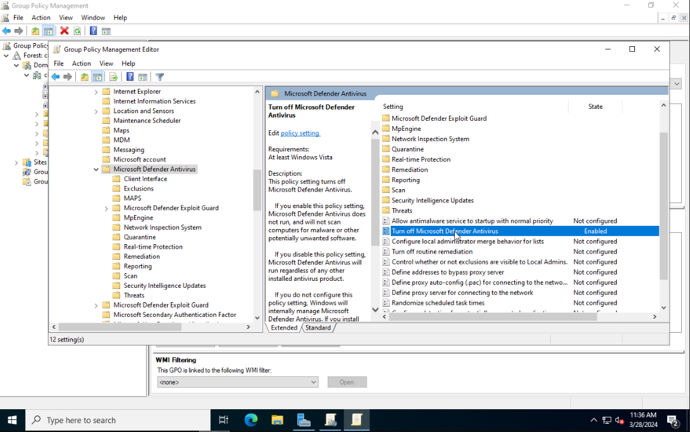
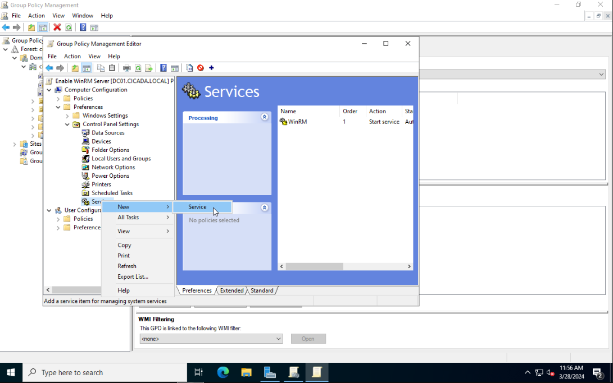
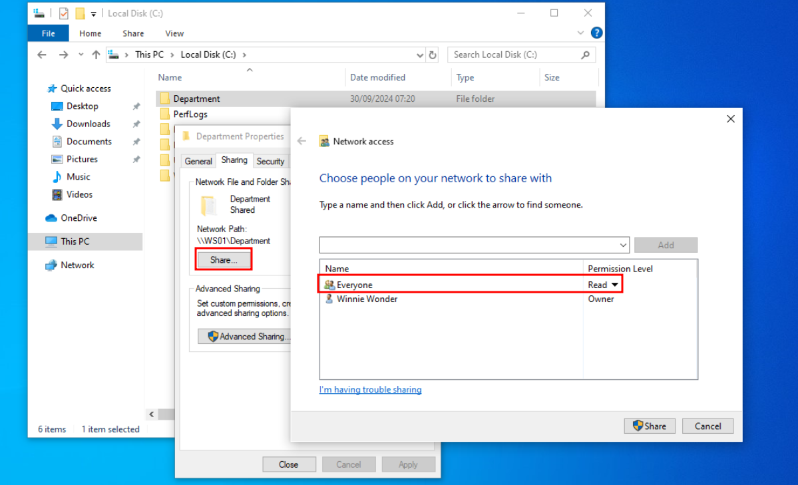
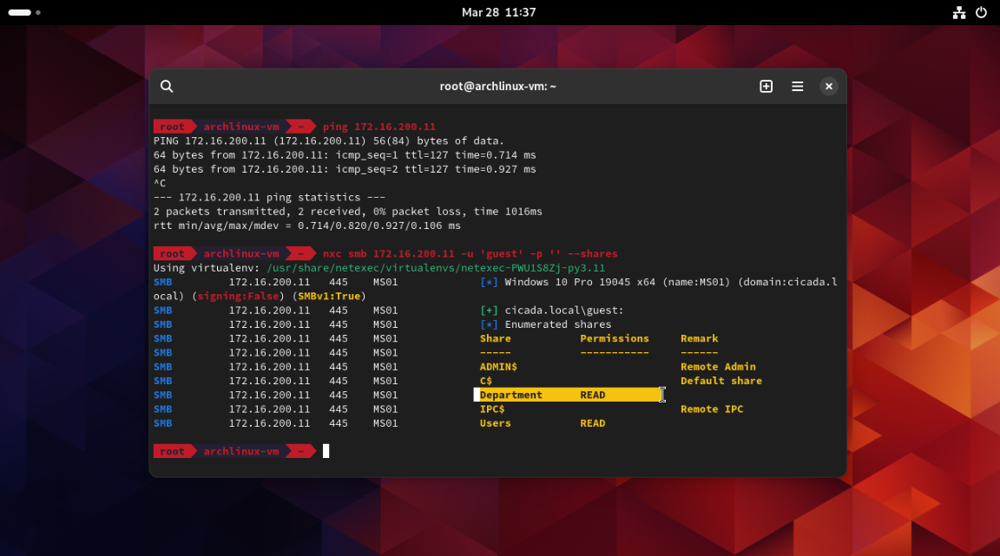

# Objective
We are now going to add some simple misconfigurations to our AD Lab. In the final section we will verify them by targeting our network from an outside Linux VM. To make the Active Directory Lab vulnerable we first need to change some settings.

# Group Policy Configuration
Open the `Start menu` and click on `Windows Administrative Tools`, then choose `Group Policy Management`. Expand `Forest` and `Domains`, to view your own domain.

## Disable Windows Defender and Firewall
We can create a first GPO that will disable the Windows Defender Firewall so we can more easily experiment with attacks later on. Of course we could also disable (unlink) the policy later.

Do not do this in a real enterprise environment! You can skip this step if you don't want to make your lab vulnerable.
{: .notice--warning}

Right-click on the domain name. Select `Create a GPO in the domain and link here`. Give the GPO the name `Disable Protections`. Right-click on the newly added policy and choose `Edit`.

This will open the `Group Policy Management Editor`. From the sidebar go to the following folder: `Computer Configuration > Policies > Administrative Templates > Windows Components > Microsoft Defender Antivirus`. Select `Microsoft Defender Antivirus`. From the right side select `Turn off Microsoft Defender Antivirus` and click on `Edit policy setting`. Set it to Enabled. Click on Apply then OK to save the changes.



Next go to `Real-time Protection` and enable `Turn off real-time protection`.


Expand the sidebar folders to the following: `Computer Configuration > Policies > Administrative Templates > Network > Network Connections > Windows Defender Firewall > Domain Profile`. Disable the `Windows Defender Firewall: Protect all network connections` setting.


Close Group Policy Management Editor. From the sidebar of Group Policy Management right-click on `Disable Protections` and choose `Enforced`.

## Enable WinRM Server
Right-click on your domain name. Select `Create a GPO in the domain and link here`. Give the GPO the name `Enable WinRM Server`. Right-click on it and choose `Edit`. Using the sidebar go to the following folder: `Computer Configuration > Policies > Administrative Templates > Windows Components > Windows Remote Management (WinRM) > WinRM Service`. Select `Allow remote server management through WinRM` and then click on `Edit policy settings`. Set the policy to `Enabled` and in the IPv4 filter field enter `*`. Click on `Apply` then `OK`.


Optionally you can enable `Allow Basic authentication` and `Allow unencrypted traffic` if you want people to perform Man-in-the-Middle attacks.

Next navigate to `Computer Configuration > Preferences > Control Panel Settings`. Right-click on `Services` and select `New > Service`.



Set `Startup` to `Automatic`. Use the `...` button to select the service name. Select `Windows Remote Management (WS-Management)` and click on Select. Set the service action to `Start Service`.


Once again in the sidebar navigate to `Computer Configuration > Policies > Administrative Templates > Windows Components > Windows Remote Shell`. Select `Allow Remote Shell Access` and enable it.


Finally go to `Computer Configuration > Policies > Security Settings > Windows Firewall with Advanced Security`. Right-click `Inbound Rules` and create a `New Rule`.


Select `Predefined` and choose `Windows Remote Management` from the list (not the one with compatible). Click `Next`. Select the one for Domain and Private, and `Allow` the connection at the next screen.

You can scan port 5985 on one of your remote computers to see if it responds (it might need a restart):
```bash
PS C:\> Test-NetConnection -ComputerName MS01 -Port 5985

ComputerName        : MS01
RemoteAddress       : 172.16.200.11
RemotePort          : 5985
InterfaceAlias      : Ethernet
SourceAddress       : 172.16.200.100
TcpTestSucceeded    : True
```

### Additional Registry Edit
I found that when applying the GPO to the domain, I was still not able to WinRM from a remote host. I found that enabling the WinRM service throught the Registry solved the issue. To do this go to `Computer Configuration > Preferences > Registry`. Right-click and select `New > Registry Item`. As the registry path select `HKEY_LOCAL_MACHINE\SOFTWARE\Policies\Microsoft\Windows\WinRM\Service` and set the value of the IPv4Filter to `*` or whatever IP range you want to include.


## Adding a Public SMB Share

### Local Share
Login as a local administator to one of your Windows VMs and navigate to `Control Panel > Network and Internet > Network and Sharing Center > Change Advanced sharing settings > Guest or Public > Turn on File and Printer sharing`.

Next create a new folder, Right-click and go to `Properties > Sharing tab > Share` and give the `Everyone` user full read and write permission (read only).



If you want to allow users to access the file share as a `Guest` user, then open `Local Security Policy` as an Administrator on the computer you want to allow guest access. Next go to `Local Policies > Security Options > Accounts: Guest account status` and switch it to Enabled. By doing this users can authenticate as the Guest user with a blank password.

### Domain Share
Login as a domain administrator to one of the domain joined hosts. Go to `Local Security Policy > Local Policies > Security Options`. Set the option `Accounts: Guest account status` to `Enabled`. Also enable `Network access: Let Everyone permissions apply to anonymous users `.


To make a folder shared on the network go to `Network access: Shares that can be accessed anonymously` and enter your folder name.

## Enforce the Domain Policies
Right-click on the Start menu and select Windows PowerShell (Admin).
In the terminal enter the following:
```bash
gpupdate /force
```
Now whenever a new device joins our AD environment the Group Policies that apply to all the devices will automatically be applied to them. With this, we have completed the Domain Controller setup.

# Validating our Configurations
Lets start by checking if we can see any available shares on the network. I made one public share on the Windows VM with IP `172.16.200.11`. In Part 1 of this series we added an attacker VM to the AD network as our initial entry point that is whitelisted from the firewall. From this host, we should be able to list the share we made public.



We can see one public folder called `Department`. We can now see what information is stored in there.
```bash
$ smbclient -U 'guest%' \\\\172.16.200.11\\Department
Try "help" to get a list of possible commands.
smb: \> dir
.                                   D        0  Wed Mar 27 23:38:24 2024
..                                  D        0  Wed Mar 27 23:38:24 2024
flag.txt                            A       25  Tue Feb 20 12:11:15 2024
Informational                       D        0  Tue Feb 20 12:06:19 2024

smb: \> more flag.txt
Br0wsing_F1L3_Sh4r3S_FTW!
```
Awesome! Seems like we got some juicy information.

To verify that we can also WinRM to our Windows VMs I created a new user called `winnie.wonder` with the password `P@ssw0rd123` and logged into `MS01` with this account. By default, PowerShell Remoting (and WinRM) only allows connections from members of the Administrators or Remote Management Group. To add our user to the Built-In Remote Management Users run:
```bash
PS C:/> net localgroup "Remote Management Users" /add winnie.wonder
```

We can now execute the following command from a Linux host inside the network:
```bash
$ nxc winrm 172.16.200.11 -u 'winnie.wonder' -p 'P@ssw0rd123'
SMB         172.16.200.11  5985   MS01             [*] Windows 10.0 Build 19041 (name:MS01) (domain:cicada.local)
HTTP        172.16.200.11  5985   MS01             [*] http://172.16.200.11:5985/wsman
HTTP        172.16.200.11  5985   MS01             [+] cicada.local\winnie.wonder:P@ssw0rd123 (Pwn3d!)
```

Nice! We can now run remote commands using the tool Evil-WinRM.
```bash
$ evil-winrm-docker -i 192.168.128.10 -u 'winnie.wonder' -p 'P@ssw0rd123'
                      
Evil-WinRM shell v3.5                                
Info: Establishing connection to remote endpoint

*Evil-WinRM* PS C:\Users\winnie.wonder.CICADA\Documents> whoami
cicada\winnie.wonder
```