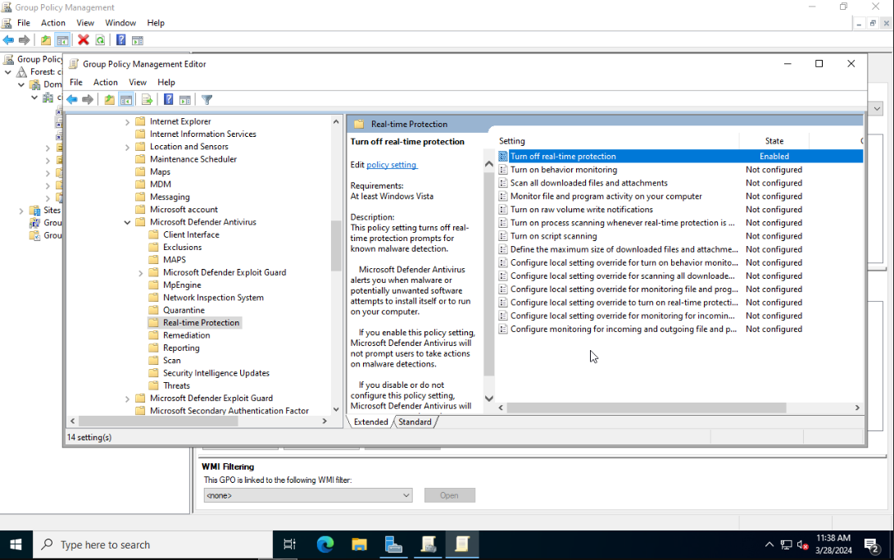
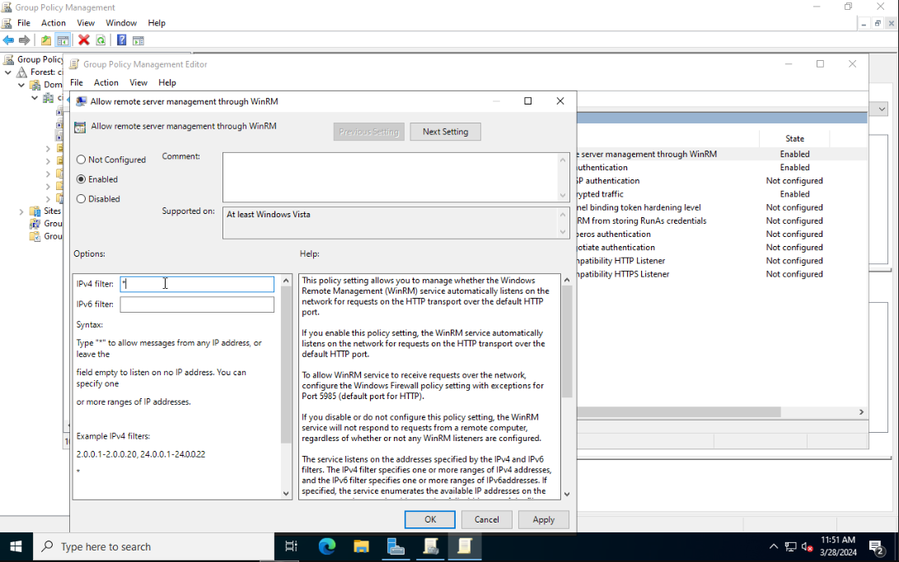
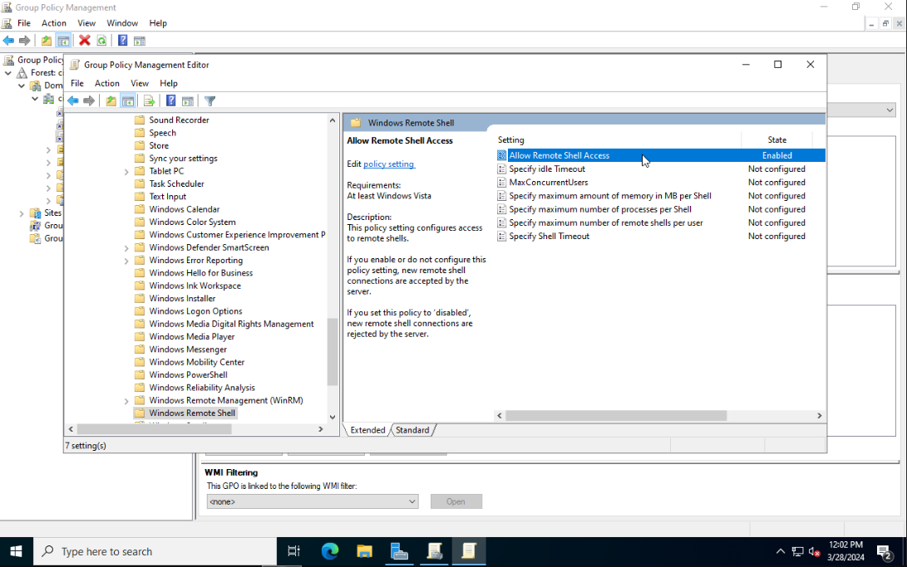

# Objective
We are now going to add some simple misconfigurations to our AD Lab that we can exploit later. To make the Active Directory Lab vulnerable we need to change some settings.

# Group Policy Configuration
Open the `Start menu` and click on `Windows Administrative Tools`, then choose `Group Policy Management`. Expand `Forest` and `Domains`, to view your own domain.

## Disable Windows Defender and Firewall
Right-click on the domain name. Select `Create a GPO in the domain and link here`. Give the GPO the name `Disable Protections`. Right-click on the newly added policy and choose `Edit`.

This will open the `Group Policy Management Editor`. From the sidebar go to the following folder: `Computer Configuration > Policies > Administrative Templates > Windows Components > Microsoft Defender Antivirus`. Select `Microsoft Defender Antivirus`. From the right side select `Turn off Microsoft Defender Antivirus` and click on `Edit policy setting`. Set it to Enabled. Click on Apply then OK to save the changes.


Next go to `Real-time Protection` and enable `Turn off real-time protection`.



Expand the sidebar folders to the following: `Computer Configuration > Policies > Administrative Templates > Network > Network Connections > Windows Defender Firewall > Domain Profile`. Disable the `Windows Defender Firewall: Protect all network connections` setting.


Close Group Policy Management Editor. From the sidebar of Group Policy Management right-click on `Disable Protections` and choose `Enforced`.

## Enable WinRM Server
Right-click on your domain name. Select `Create a GPO in the domain and link here`. Give the GPO the name `Enable WinRM Server`. Right-click on it and choose `Edit`. Using the sidebar go to the following folder: `Computer Configuration > Policies > Administrative Templates > Windows Components > Windows Remote Management (WinRM) > WinRM Service`. Select `Allow remote server management through WinRM` and then click on `Edit policy settings`. Set the policy to `Enabled` and in the IPv4 filter field enter `*`. Click on `Apply` then `OK`.



Also enable `Allow Basic authentication` and `Allow unencrypted traffic`.

Next navigate to `Computer Configuration > Preferences > Control Panel Settings`. Right-click on `Services` and select `New > Service`.


Select `Startup` to `Automatic`. Use the `...` button to select the service name. Select `Windows Remote Management (WS-Management)` and click on Select.


Using the sidebar navigate to the following location: `Computer Configuration > Policies > Administrative Templates > Windows Components > Windows Remote Shell`. Select `Allow Remote Shell Access` and enable it.



Finally go to `Computer Configuration > Policies > Administrative Templates: Policy definitions > Network > Network Connections > Windows Firewall > Domain Profile`. Right-click on `Windows Firewall: Allow inbound remote administration exception` and click Edit. Select Enabled.

## Add Public SMB Share

### Local SMB Share
Login as a local administator to one of your Windows VMs and navigate to `Control Panel > Network and Internet > Network and Sharing Center > Change Advanced sharing settings > Guest or Public > Turn on File and Printer sharing`.

Next create a new folder, Right-click and go to `Properties > Sharing tab > Share` and give the `Everyone` user full read and write permission (read only).


### Domain SMB Share
Login as a domain administrator to one of the domain joined hosts. Go to `Local Security Policy > Local Policies > Security Options`. Set the option `Accounts: Guest account status` to `Enabled`. Also enable `Network access: Let Everyone permissions apply to anonymous users `.


To make a folder shared on the network go to `Network access: Shares that can be accessed anonymously` and enter your folder name.

## Enforce the Domain Policies
Right-click on the Start menu and select Windows PowerShell (Admin).
In the terminal enter the following:
```Powershell
gpupdate /force
```
Now whenever a new device joins our AD environment the Group Policies that apply to all the devices will automatically be applied to them. With this, we have completed the Domain Controller setup.

# Validating our Configurations
Lets start by checking if we can see any available shares on the network. I made one public share on the Windows VM with IP `172.16.200.11`. In Part 1 of this series we added an attacker VM to the AD network as our initial entry point that is whitelisted from the firewall. From this host, we should be able to list the share we made public.


We can see one public folder called `Department`. We can now see what information is stored in there.


