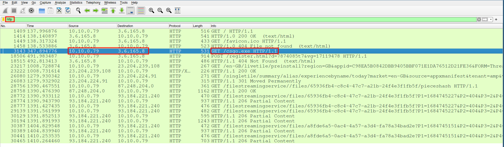
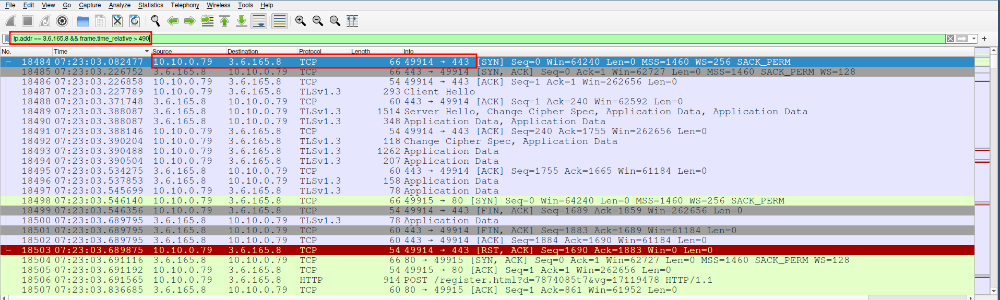
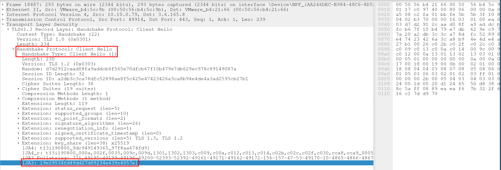
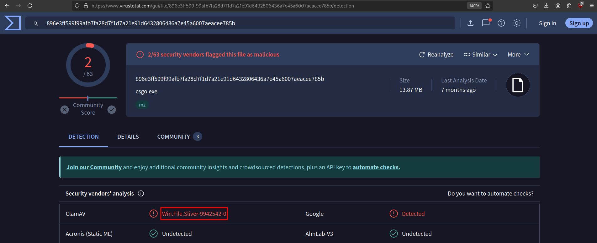
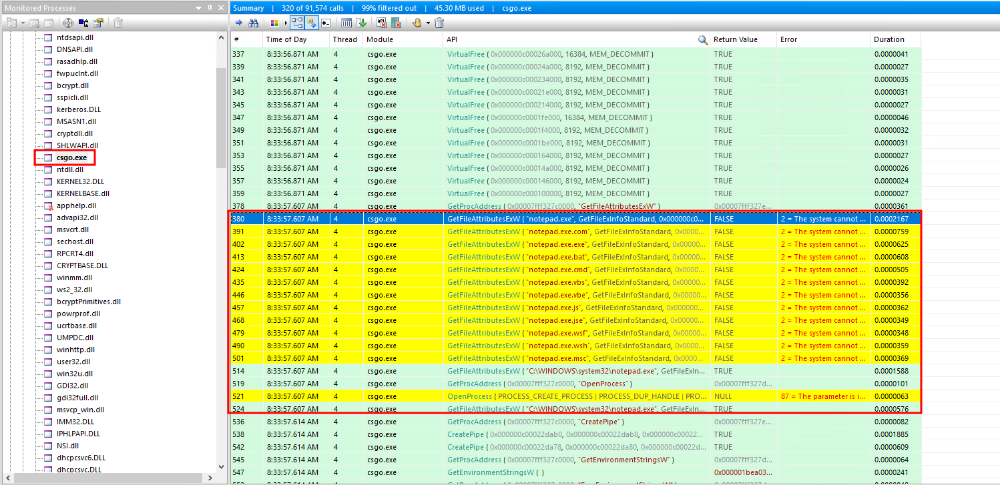
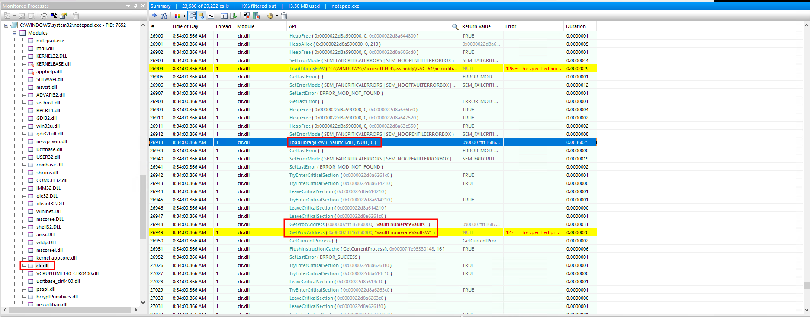
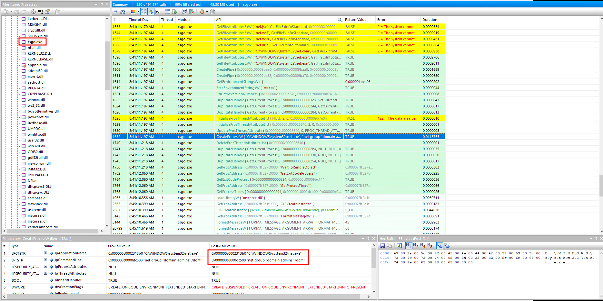
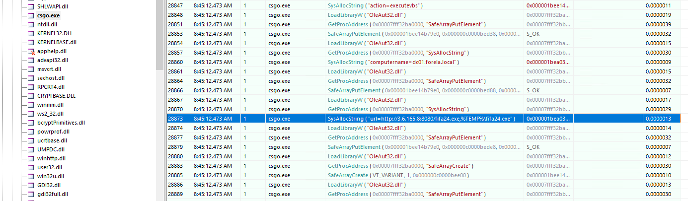

With the increasing use of open-source Command and Control (C2) frameworks by threat actors, it has become crucial for blue teams to develop strategies to detect and mitigate these threats. In this exercise, our red team simulated an attack using a popular open-source C2 framework to help improve defenses. We were provided with PCAP files, EVTX logs, and API traces, which we will analyze to uncover the attack's methodology. 

# Introduction to Tools and Files
During this investigation, we will use various tools to examine the artifacts:
- **Wireshark** for analyzing the network traffic captured in PCAP files.
- **API Monitor** to track API calls made by malicious executables.
- **VirusTotal** to identify and analyze potential malware.

One of the less familiar file types encountered, `.apmx64`, is associated with **API Monitor**, a powerful tool for monitoring and controlling API calls made by applications. This tool was instrumental in understanding the behavior of the malware on the host.

# Analyzing the Packet Capture
## CSGO Malware Download and Execution
We begin by examining the `Employee.pcapng` file using Wireshark. Filtering the traffic by the HTTP protocol, we quickly identified a file named `csgo.exe` being downloaded.



The download was completed around `7:22:22 UTC`. Following this, the malware attempted to establish a connection with a remote IP address (`3.6.165.8`) over port `443`, likely to secure its communications using TLS.



This type of communication is typical of C2 servers, where the malware contacts a command server to receive further instructions or to exfiltrate data. To further analyze the server, we extract the JA3 fingerprint from the TLS handshake. 

The JA3 fingerprint is a unique identifier generated from the client's TLS configuration, which can be used to detect malicious activity even if the IP address changes.
{: .notice--info}



## Identifying the C2 Framework: Sliver Detection
To determine the C2 framework being used, we can extract the `csgo.exe` binary from the packet capture by following the TCP stream of the HTTP request and exporting the payload. We will then upload this binary to **VirusTotal** for analysis.



VirusTotal identified the binary as associated with the Sliver C2 framework, a popular open-source tool used by both red teams and malicious actors for post-exploitation tasks. Sliver provides various capabilities, including remote command execution, lateral movement, and credential harvesting.

# Monitoring API Calls with API Monitor
## Accessing Secure Vault Data
The next phase of the investigation involves examining the behavior of the `csgo.exe` malware on the infected system. Using [API Monitor](http://www.rohitab.com/apimonitor), we can track the API calls made by this process. Early in the execution, the malware retrieved the current working directory using the `GetCurrentDirectoryW` API call. Shortly afterward, it launched a new process named `notepad.exe`.



Sliver typically spawns a sacrificial process (often notepad.exe) when using the execute-assembly command, injecting .NET assemblies into the process for execution.  This can be changed, but it seems like the defaults were utilized by the operators.

Next, we observe the malware loading the `vaultcli.dll` module into the `notepad.exe` process. This library is used to interact with the Windows Credential Manager (often referred to as the Windows Vault), which stores and retrieves user credentials. By loading this DLL, the attacker aimed to enumerate and potentially extract sensitive credentials stored in the vault.


The specific API call observed was `VaultEnumerateVaults`, which lists the available vaults on the system. This suggests the attacker was attempting to identify and access stored credentials, possibly to facilitate lateral movement within the network. Credential theft is a common goal in such attacks, as it allows threat actors to escalate privileges and gain access to additional systems.



Following the vault enumeration, the attacker initiated another significant action: enumerating domain users. This was done by executing the `net.exe` utility, a command-line tool used for network administration.

```powershell
net group "domain admins" /dom
```

This command lists all members of the "Domain Admins" group, which typically has high-level privileges across the domain. Gaining knowledge of these users is crucial for an attacker, as compromising one of these accounts can give them control over the entire domain.

## Downloading Additional Malware via WMI
The investigation revealed that after gaining access to domain information, the attacker used WMI (Windows Management Instrumentation) to download another Sliver beacon, named `fifa24.exe`, to the Domain Controller (DC).



WMI is a powerful feature in Windows that allows for remote management of systems, including executing commands, scripts, and managing files. The attacker used a tool from the Sliver ARMORY called `SharpWMI` to download and execute this payload on the DC. This indicates that the attacker had already escalated privileges, likely by compromising a domain admin account retrieved from the Windows Vault, enabling them to execute commands remotely on the DC.

## Extracting the NTDS.dit File
One of the most critical actions taken by the attacker was the extraction of the `NTDS.dit` file. This file contains a database of Active Directory (AD) data, including password hashes for all domain users.


After the file was retrieved, the attacker compressed it using the `Compress-Archive` PowerShell command:

```powershell
powershell Compress-Archive . ntds.zip
```

Compressing the `NTDS.dit` file and other related files into a zip archive is a common tactic used to prepare the data for exfiltration. Once the file is compressed, it becomes easier to transfer out of the network, typically over encrypted channels to avoid detection.

# Conclusion
In this exercise, we observed a sophisticated attack leveraging the Sliver C2 framework, which included the use of process injection, credential harvesting, remote command execution, and data exfiltration. By understanding the tactics and techniques used, blue teams can better prepare for similar threats in their environments.

## Key Takeaways:

- **Use of C2 Frameworks**: Open-source C2 frameworks like Sliver are increasingly used by both red teams and malicious actors. Being familiar with their behaviors, such as JA3 fingerprints and typical process injections, is essential for detection.
- **Credential Theft**: The attack demonstrated a focus on accessing and leveraging credentials, particularly through Windows Vault and domain enumeration, underscoring the importance of securing credential stores and monitoring access.
- **Lateral Movement**: The use of WMI to move laterally within the network highlights the need for monitoring such administrative tools for unusual activity.
- **Data Exfiltration**: The extraction and compression of the NTDS.dit file show how attackers can target critical AD components, making it imperative to secure and monitor these assets closely.