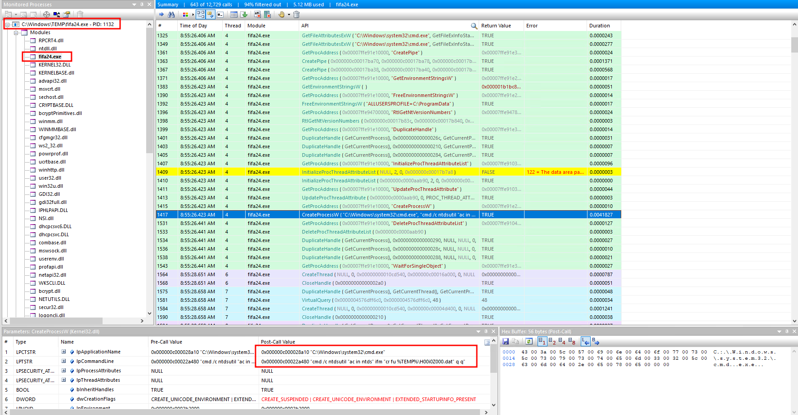

With the rising utilization of open-source C2 frameworks by threat actors, our red team has simulated the functionalities of one such widely employed framework. The objective of this exercise is to aid blue teams in strengthening their defenses against these specific threats. We have been provided with PCAP files and APIs collected during the event, which will serve as valuable resources. Using the API Monitor: We are well-acquainted with opening PCAP and .EVTX files, but what are .apmx64 ? The .apmx64 file extension is associated with API Monitor, a software used to monitor and control API calls made by applications and services. 

# Packet Capture
## CSGO Malware
Starting with the given `Employee.pcapng` file we can look for any downloaded files with [WireShark](https://www.wireshark.org). Filtering packets on the `HTTP` protocol, we see a file called `csgo.exe` being downloaded.


After changing our time to UTC and following the file stream, we can see that the malware finished downloading at around `7:22:22`. Next we check for any further connections to the remote IP after this timestamp.


The malware attempts to connect to `3.6.165.8` over port `443` in order to secure its communication. After confirming the malicious IP, we can extract the `JA3` fingerprint of the C2 server.

The JA3 fingerprint is a 32-character hash derived from the TLS Client Hello of an incoming request. This fingerprint serves as a unique identifier for the client's TLS configuration.
{: .notice--info}


## Sliver Detection
To determine the C2 framework being used we can try to extract the binary. Going to the `GET /csgo.exe` request, we can follow the TCP stream and export it to a file. Next we can submit this binary to VirusTotal.


VirusTotal only gives back one detection for the `Sliver` C2 framework. We can now proceed to look what operations were performed on the infected hosts.

# API Monitor
## Accessing Secure Vault
Looking at the `csgo.exe` binary inside [API Monitor](http://www.rohitab.com/apimonitor), we see that a directory listing is executed for the user `alonzo.spire` via the `GetCurrentDirectoryW` Win32 API. Following this action, a new process is executed with the name `notepad.exe`.


By default, Sliver will start a sacrificial process for `notepad.exe` when utilizing the `execute-assembly` command and loads the .NET CLR into it. This can be changed, but it seems like the defaults were utilized by the operators. Looking at the started `notepad.exe` process and viewing the injected `clr.dll` file, the `vaultcli.dll` module is loaded to gain access to the Windows Vault.


The attacker then tried to enumerate the Windows Vaults as can be see by the `VaultEnumerateVaults` Win32 API being loaded. Afterwards we see another process being created (`net.exe`) for enumerating users on the domain.


The attacker executed the following command to identify domain admins.

```powershell
net group "domain admins" /dom
```

## Download over WMI
Next the attacker downloaded another Sliver beacon with the name `fifa24.exe` to the domain controller via WMI. The tool used from the Sliver ARMORY is `SharpWMI`.


To be able to do this, the attacker should have the required permissions on the DC. We can presume that the attacker gained access to domain admin credentials from the Windows Vault. 

## Extracting NTDS
After the attacker moved laterally to the Domain Controller, a command was executed to extract the `NTDS.dit` file.



Afterwards this file was compressed to a zip file. The specific Win32 API responsible for retrieving the full path of the file is `GetFullPathNameW`. The following command was used in order to compress the NTDS file.

```powershell
powershell Compress-Archive . ntds.zip
```
