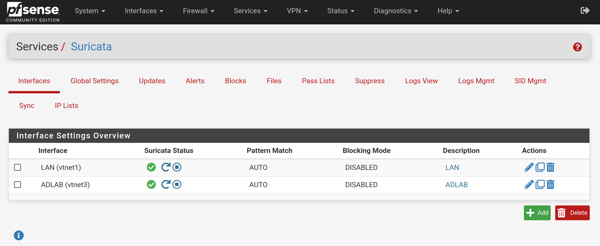
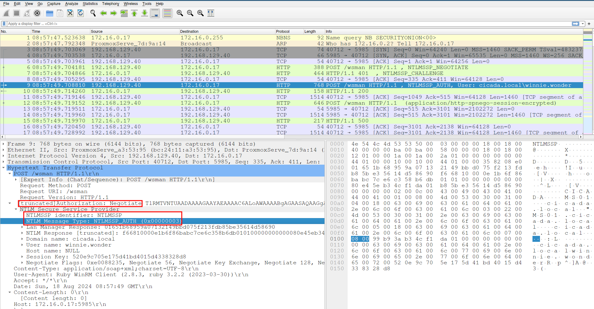
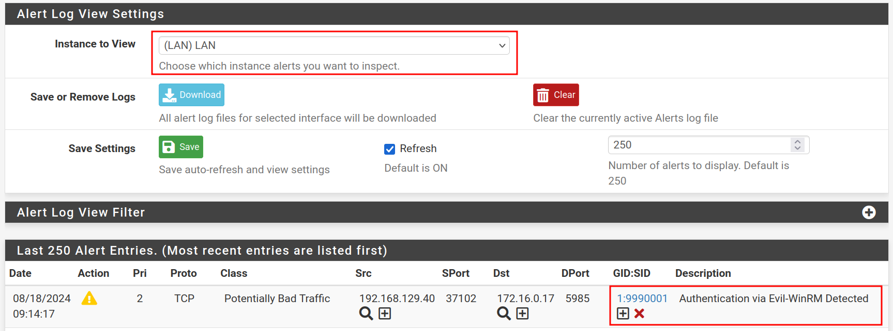
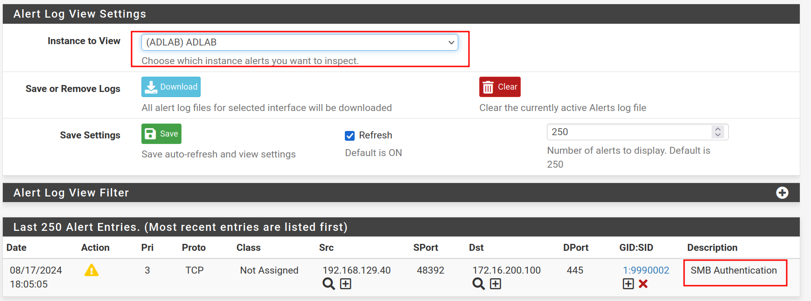
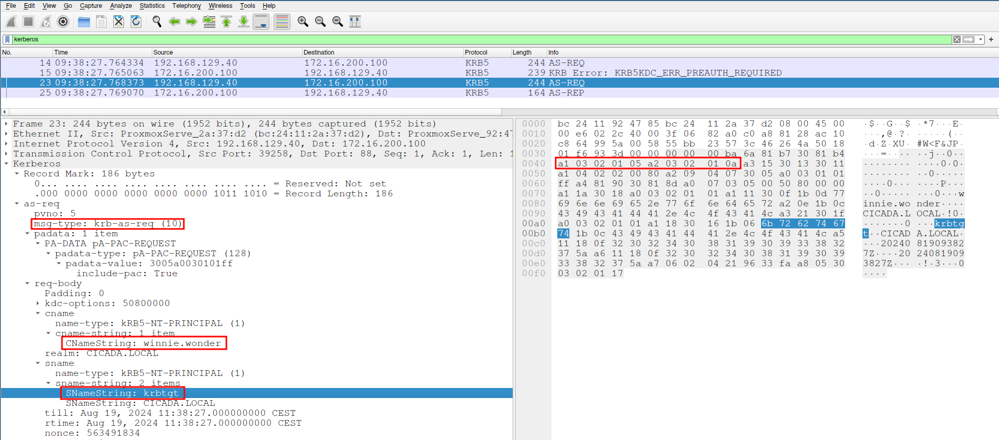

In this part of our Active Directory Home Lab series, we'll focus on enhancing the security and visibility of our environment by adding network monitoring. Since we're utilizing PfSense as our software-based firewall, it provides a convenient platform for deploying additional security tools. Specifically, we'll be setting up Suricata, a powerful intrusion detection and prevention system (IDS/IPS), to monitor traffic and detect potential threats. This post will guide you through configuring Suricata and creating custom rules to detect attacks, such as those we simulated in Part 3.

# Suricata Setup
To begin, navigate to the PfSense web interface and proceed to `System > Package Manager > Available Packages`. Search for Suricata and install the latest version. Once installed, go to `Services > Suricata` to start configuring the tool. We’ll add interfaces and tweak some options, but the default settings should suffice for most purposes. For our ruleset, we'll use the ETOpen Emerging Threats as a foundation.

## Adding Monitoring Interfaces
Under the Interfaces tab, select the interfaces that Suricata will monitor. For our lab, I chose the `LAN` and `ADLAB` interfaces to observe traffic between the attacking VM on the LAN and the AD network.



## Creating Custom Detection Rules
Next, let's create custom rules tailored to our lab environment. We’ll do this by editing one of the interfaces and navigating to the rules tab.


### Detecting Evil-WinRM Traffic
Our first custom rule will detect Evil-WinRM traffic, which is often used for remote management in penetration testing scenarios. For more information on setting up Remote Management on your target hosts, refer to Part 3 of this series.


To build this rule, we need to understand how an authentication request from Evil-WinRM appears in network traffic. Using WireShark, we can capture an authentication attempt from a host on the LAN interface. We run the following command in a Linux terminal:

```console
$ evil-winrm -i 172.16.0.17 -u 'cicada.local\winnie.wonder' -p 'P@ssw0rd123'
```

To capture this traffic in PfSense, go to `Diagnostics > Packet Capture` and select the appropriate interface.

**Tip:** Ensure you target the domain-joined host from a machine outside of the LAN to properly capture traffic. If you capture traffic from devices within the same LAN, PfSense may not log the packets you're interested in.
{: .notice--info}

In WireShark, we can focus on the packet containing the authentication request.



The captured packet shows the authentication request from `winnie.wonder`. Based on this, we can now craft our Suricata rule:
```
alert http any any -> any 5985 (msg: "Connection via Evil-WinRM Detected"; flow:established,to_server; http.method; content:"POST"; http.header; content:"User-Agent: Ruby WinRM Client"; content:"Authorization: "; base64_decode:bytes 13,offset 10,relative; base64_data; content:"NTLMSSP"; content:"|03|"; classtype:bad-unknown; sid:9990001; rev:1;)
```

**Snort** is a similar IDS/IPS solution that can be installed on PfSense, but has slightly different syntax.
{: .notice--info}

Explanation:
- The rule targets HTTP traffic performing a POST request on port 5985.
- It looks for the `Ruby WinRM Client` string in the User-Agent header, a unique identifier for Evil-WinRM.
- The rule then examines the Authorization header, decoding a portion of the Base64 encoded data to detect the NTLMSSP authentication type.

With this rule in place, Suricata will trigger an alert whenever someone tries to authenticate using Evil-WinRM using the default settings. We could tune this rule even further, or write additional rules that alert on traffic even if the attacker changes the User-Agent.



### Detecting SMB Authentication
Similarly, we can create a custom rule to detect SMB authentication attempts within the `CICADA` domain. The below rule looks for the SMB header with the NTLMSSP authentication type set to `03` and the domain name in hex format, separated by null bytes.

```
alert smb any any -> any 445 (msg: "SMB Authentication";flow:established,to_server; content:"|FE|SMB";content:"NTLMSSP"; content:"|03|";distance: 1; content:"|63 00 69 00 63 00 61 00 64 00 61|"; sid:9990002; rev:1;)
```

This rule was applied to the ADLAB interface. To test it, I used `NetExec` to initiate an SMB authentication from outside the ADLAB interface:

```console
nxc smb 172.16.200.100 -u 'winnie.wonder' -p 'P@ssw0rd123' -d 'cicada.local'
```

As expected, Suricata raised an alert upon detecting the authentication:


### Detecting AS-REPRoasting
In the third part of our series, we executed the following command to perform an ASREPRoasting attack on domain users:

```
GetNPUsers.py CICADA.LOCAL/ -dc-ip 172.16.200.100 -no-pass -usersfile valid_users -format hashcat
```

Now, let’s examine what this traffic looks like in WireShark


In this scenario, we identified one user with preauthentication disabled. By analyzing the `AS-REQ` packet, we can craft a Suricata rule to detect this type of attack:

```
alert tcp any any -> any 88 (msg:"Possible AS-REP Roasting Attack"; flow: to_server, stateless; content:"|a0 07 03 05 00 50 80 00 00 a1|"; content:"|6b 72 62 74 67 74|"; fast_pattern; content:!"|a2 03 02 01 0c|"; sid:9990003; rev:1;)
```

Rule Breakdown:

- The rule monitors TCP traffic on port 88, which is used by Kerberos.
- It looks for a specific sequence of bytes that indicate the presence of an AS-REQ request.
- The string krbtgt (represented as `6b 72 62 74 67 74` in hexadecimal) is a key identifier within the packet.
- We also check for the absence of the byte sequence `a2 03 02 01 0c`, which indicates the presence of preauthentication. The lack of this sequence suggests the possibility of an AS-REP Roasting attack.

By implementing this rule, Suricata will trigger an alert when it detects a pattern consistent with an ASREPRoast attack, helping to protect your domain from this common exploitation method.

# Conclusion
In this part we have seen how we can leverage Suricata to detect malicious traffic on our network. We have also learned how we can write our own rules based on IOCs. By implementing these custom rules, you can enhance the security of your Active Directory lab environment, gaining visibility into specific attacks and unauthorized access attempts.